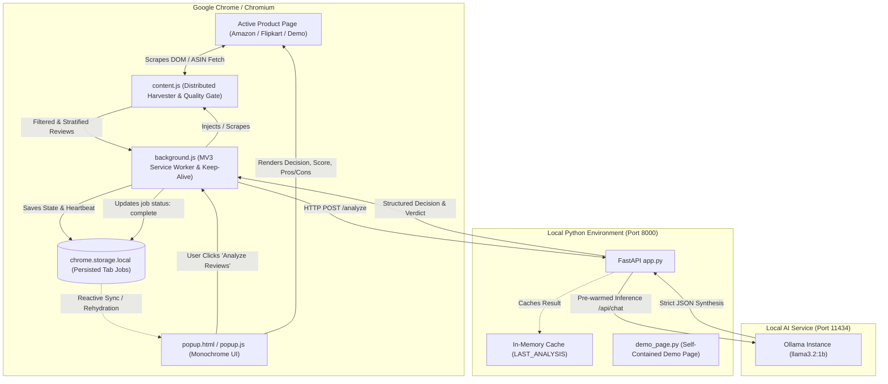

# ⚡ easymode - Project Architecture & Component Summary

**easymode** is a privacy-first, local AI-powered browser extension and backend service that delivers instant, objective product purchase evaluations on e-commerce platforms (Amazon, Flipkart, IMDb). Running locally on **Ollama** using lightweight models like **Llama 3.2 (1B/3B)**, the application extracts, distills, and analyzes customer reviews entirely on the user's machine without transmitting browsing history or review data to external cloud APIs.

---

## 1. High-Level Architecture & End-to-End Data Flow

### End-to-End Lifecycle
1. **User Action:** The user opens the extension on an Amazon/Flipkart product page and clicks **Analyze Reviews** (or customizes the review sample size in the Debug drawer).
2. **Job Initiation:** `popup.js` detects the active tab and dispatches a `START_ANALYSIS` message to the background service worker (`background.js`), immediately initiating persistent UI loading state.
3. **Distributed Harvesting:** `background.js` triggers `content.js` in the active tab context. `content.js` either queries Amazon's multi-page review pagination endpoints in parallel using the product's ASIN or scrapes the rendered DOM, cleans noise/variant tags, eliminates single-word reviews, aggregates star distributions, and stratifies a balanced cohort (positive, mixed, critical).
4. **Resilient Local Inference:** `background.js` posts the representative reviews to the FastAPI backend (`http://localhost:8000/analyze`). Simultaneously, `background.js` runs an automated keep-alive heartbeat loop to prevent Chrome Manifest V3 from killing the service worker during long inferences.
5. **Prompting & Synthesis:** FastAPI formats the reviews and macro star ratings into a constrained system prompt, dispatching it to local Ollama (`http://localhost:11434/api/chat`).
6. **Fault-Tolerant Parsing:** The backend receives Ollama's raw JSON, validates it with a fallback parser, strips generic adjectives, normalizes the decision, caches the result in `LAST_ANALYSIS`, and returns the final payload.
7. **Reactive Presentation:** `background.js` saves the completed state to `chrome.storage.local`. The popup UI listens to `chrome.storage.onChanged` and instantly renders the decision badge, satisfaction score, pros checklist, cons checklist, and 2-sentence verdict.

---

## 2. Component Breakdown

### 2.1 Chrome Extension (`easymode-extension/`)

Built on **Manifest V3**, the extension is split into three decoupled contexts to guarantee stability across tab changes, popup collapses, and long inference runs:

#### 1. Background Service Worker (`background.js`)
- **Lifecycle Decoupling:** Chrome extension popups are ephemeral (destroyed immediately when clicking outside or switching tabs). `background.js` runs as an independent service worker that manages the extraction and backend query lifecycle independently of the popup DOM.
- **Service Worker Keep-Alive Engine:** Chrome MV3 terminates service workers after 30 seconds of inactivity, which causes long LLM runs (35s+) to drop sockets mid-flight. `background.js` solves this by running `startKeepAlive()`, invoking `chrome.runtime.getPlatformInfo()` every 12 seconds during active pipelines to reset Chrome's 30-second idle timer.
- **Persistent State Storage:** Analysis jobs are persisted in `chrome.storage.local` keyed by `job_${tabId}`. When a popup collapses and re-opens, it immediately reads from storage and resumes progress without losing state.
- **Tab Lifecycle Management:** Listens to `chrome.tabs.onRemoved` and `chrome.tabs.onUpdated` to automatically abort ongoing requests and delete persisted data when a user closes or navigates away from the product tab.
- **Cancellation:** Maintains an `activeAbortControllers` map. When the user clicks **Cancel**, `background.js` aborts the ongoing `fetch` request, clears storage, and resets the UI state immediately.
- **Backend Cache Recovery:** If an unexpected network interruption occurs right as the backend completes, `background.js` checks `GET /analysis/latest` to recover the completed synthesis before declaring an error.

#### 2. Distributed Review Harvester & Quality Gate (`content.js`)
- **Direct ASIN Parallel Harvester:** For Amazon product pages (`/dp/{ASIN}`), extracts the 10-character ASIN and fetches pages 1 and 2 of customer reviews in parallel using same-origin `fetch()`. This bypasses Amazon's lazy-loading, DOM obfuscation, and infinite scroll mechanisms, extracting 30–50+ reviews in under 400ms without requiring the user to scroll.
- **Noise & Boilerplate Stripper:** Employs regex filters (`JUNK_PATTERNS`) to strip variant clutter (e.g., `- Size: 100 ml (Pack of 1)`, `Colour: Matte`), verified purchase badges, "helpful" vote counters, and machine translation notes.
- **Substantive Quality Gate:** Drops low-signal one-word reviews (e.g., `"Nice"`, `"Best"`, `"ok"`, `"Good"`, `"Buy 1 product"`) that confuse LLMs.
- **Stratified Representative Sampling:** Stratifies collected reviews into three distinct buckets:
  - **Positive:** 4★ and 5★ reviews (~45% of sample)
  - **Critical:** 1★ and 2★ reviews (~35% of sample)
  - **Mixed / Neutral:** 3★ reviews (~20% of sample)
  This guarantees that negative defect warnings are never drowned out by hundreds of 5-star ratings.
- **Statistical Aggregator:** Computes quantitative 1–5 star counts and average satisfaction index across the entire harvested cohort to provide macro context to the LLM.

#### 3. Frontend Interface (`popup.html`, `popup.css`, `popup.js`)
- **Monochrome Dark Slate Theme:** Professional dark UI (`#0f131a`, `#141923`, `#1e2430`, `#f8fafc`) featuring thin off-white borders, rounded card geometry, and clean typography.
- **Reactive State Rehydration:** On `DOMContentLoaded`, `restoreTabState()` inspects `chrome.storage.local`. If an analysis is ongoing, it displays the loading spinner with a live timer computed from `job.startTime`. If completed, it renders the results instantly.
- **Live Elapsed Timer:** Continuously reflects the true uninterrupted elapsed time without resetting if the popup is closed and re-opened.
- **Reactive Storage Sync:** Subscribes to `chrome.storage.onChanged` so any state change written by `background.js` triggers immediate DOM updates.
- **Cancel Button:** Integrated directly into the loading status bar (`#cancelBtn`) with SVG icon and abort logic.
- **Expandable Debug Drawer (`Cmd+Shift+D`):**
  - **Effort Controller:** Preset buttons and a slider allowing the user to select analysis depth (3 to 30 reviews).
  - **Diagnostics & Metrics:** Real-time stage indicators, harvested review counts, active LLM ingest count, and processing duration.
  - **Raw Review Inspector:** Displays every review actively selected for LLM processing with star ratings.
  - **Live Console Log:** Monospaced terminal log with copy and clear actions.
  - **1-Click Offline Demo Link:** Visible when backend runs in offline mode.
- **Manual Review Input:** Collapsible textarea fallback allowing arbitrary review text evaluation.

---

### 2.2 Local Backend Service (`easymode-backend/`)

Built with **FastAPI** and **Uvicorn**, the backend handles model orchestration, validation, prompt safety, and fallback handling:

#### 1. Application Core (`app.py`)
- **Model Pre-Warming (`lifespan`):** On startup and during health checks (`GET /health`), sends a lightweight ping to Ollama with `keep_alive="60m"` to load weights into memory ahead of time, eliminating initial cold-start latencies.
- **Pydantic Validation:**
  - `AnalyzeRequest`: Validates input review list, total review counts, and macro distribution stats.
  - `AnalyzeResponse`: Validates output fields: `decision`, `score` (0-100), `pros` (List[str]), `cons` (List[str]), `verdict` (str).
- **Prompt Engineering:**
  - Injects macro statistical metrics (total cohort size, 1-5 star breakdown, satisfaction index).
  - Enforces strict rules: no single-word bullet points, no brand names, max 15 words per bullet, strictly 2–3 pros and 2–3 cons.
  - Formats output exclusively as raw JSON.
- **Ollama Parameter Tuning:**
  - `temperature: 0.15` and `top_p: 0.85` for deterministic evaluation.
  - `num_predict: 320` to eliminate generation lag beyond the expected JSON structure.
  - `num_ctx: 2048` for fast prompt prefill.
- **Multi-Layered Fault-Tolerant JSON Parsing (`robust_parse_model_json`):**
  - Attempts standard `json.loads` after stripping code blocks.
  - If invalid or truncated, applies regex extraction for `"decision"`, `"score"`, `"pros"`, `"cons"`, and `"verdict"`.
- **Post-Processing & Sanitization:**
  - `clean_bullet_text`: Strips markdown bullets, numbering, quotes, and product variant sizing tags.
  - `is_valid_bullet`: Drops single words and generic filler.
  - `normalize_decision`: Normalizes fuzzy model ratings to standardized values: `"Strong Buy"`, `"Mixed / Consider Alternatives"`, or `"Pass"`.
- **In-Memory Cache & Status Endpoints:**
  - `LAST_ANALYSIS`: Stores the most recent completed analysis.
  - `GET /analysis/latest`: Returns the cached result for instant recovery if client sockets disconnect.
  - `GET /analysis/status`: Returns current pipeline execution status (`idle` vs `analyzing`).

#### 2. Offline Demo Engine (`demo_page.py`)
- Provides a completely isolated presentation environment when internet connectivity is poor or blocked.
- Serves an authentic, self-contained offline copy of the Amazon product page for **Lakmé Sun Expert SPF 50** ([ASIN: B00CS1KT96](https://www.amazon.in/gp/product/B00CS1KT96/)) at `http://localhost:8000/demo`.
- Includes pre-extracted authentic customer reviews in `offline_data/B00CS1KT96_reviews.json`.
- The extension automatically recognizes `http://localhost:8000/demo` as an Amazon product page and executes the full workflow offline.

#### 3. Automated Runner (`run.sh`)
- Manages virtual environment (`.venv`), installs dependencies from `requirements.txt`, checks Ollama connectivity, and starts Uvicorn with auto-reload.
- Supports `--offline` / `--demo` flag to launch the backend in offline demonstration mode.

---

### 2.3 Local AI Inference Engine (Ollama)

- **Default Model:** `llama3.2:1b` (compatible with `llama3.2:3b` or `qwen2.5:1.5b`).
- **Port:** `http://localhost:11434`.
- **Privacy Guarantee:** 100% on-device processing. No network packets leave the machine during analysis.
- **Memory Retention:** Configured with `keep_alive: "60m"` to ensure the model remains resident in RAM/VRAM between product navigations.

---

## 3. Technical Challenges & Architectural Solutions

| Challenge | Root Cause | Solution Implemented |
| :--- | :--- | :--- |
| **Popup State Loss on Click-Away** | Manifest V3 popups are ephemeral; Chrome destroys the DOM and terminates execution when focus is lost. | Shifted analysis execution to a persistent background service worker (`background.js`) and stored active/completed jobs in `chrome.storage.local` keyed by `tabId`. |
| **Service Worker Termination Mid-Inference** | Chrome MV3 terminates idle background service workers after 30s. Long LLM inferences (>35s) caused Chrome to kill the worker and sever network sockets. | Added `startKeepAlive()` in `background.js` to ping `chrome.runtime.getPlatformInfo()` every 12s, resetting the inactivity timer during inference. Added an open port heartbeat with `popup.js`. |
| **Delayed or Disconnected Socket Responses** | Fast-completing Ollama calls could write to a socket that was closed or suspended by browser power-saving. | Added `LAST_ANALYSIS` cache and `GET /analysis/latest` endpoint in `app.py`. Both `background.js` and `popup.js` query this endpoint to recover finished results without re-running Ollama. |
| **Nonsensical / One-Word Pros & Cons** | Small LLMs (1B parameters) tend to echo simple review phrases (`"Nice"`, `"Best"`, `"- Size: 100 ml"`). | Added a dual-stage cleaning pipeline: `content.js` removes boilerplate and variant metadata; `app.py` enforces regex-based bullet sanitization and drops brand names and sizing strings. |
| **Token Bloat & Slow Inference** | E-commerce pages contain thousands of words of conversational fluff, causing slow prompt processing on CPUs. | Implemented Stratified Representative Sampling in `content.js`, distilling 30–50+ reviews down to 10–14 high-signal reviews (~300 tokens), speeding up turnaround time to 2–5 seconds. |
| **Unreliable Internet during Live Demos** | E-commerce websites frequently trigger bot captchas or rate limits on public Wi-Fi. | Built a self-contained offline demo system (`./run.sh --offline`) serving an authentic Amazon page with pre-extracted reviews at `http://localhost:8000/demo`. |

---

## 4. Key Endpoints & Extension Messaging Reference

### Backend Endpoints (`http://localhost:8000`)
- `GET /health` — Health check, returns model name, offline mode flag, and demo URL. Pre-warms the Ollama model in background.
- `POST /analyze` — Accepts `{ reviews, total_analyzed, stats }`, runs Ollama inference, returns structured decision and verdict.
- `GET /analysis/latest` — Returns the latest completed analysis result for instant client recovery.
- `GET /analysis/status` — Returns current processing status (`idle` vs `analyzing`) and cached payload.
- `GET /demo` — Serves the offline Amazon product page for Lakmé Sun Expert.
- `GET /api/demo-reviews` — Returns pre-extracted JSON reviews for ASIN B00CS1KT96.

### Extension Runtime Messages (`chrome.runtime`)
- `START_ANALYSIS` (`popup.js` -> `background.js`) — Triggers full tab extraction and backend query for specified `tabId` and `effort`.
- `START_MANUAL_ANALYSIS` (`popup.js` -> `background.js`) — Sends user-pasted reviews to background worker.
- `CANCEL_ANALYSIS` (`popup.js` -> `background.js`) — Aborts the active `AbortController` and clears stored job for `tabId`.
- `CLEAR_JOB` (`popup.js` -> `background.js`) — Clears results and resets state in storage.
- `GET_JOB_STATUS` (`popup.js` -> `background.js`) — Queries the current status of an ongoing or completed job.
- `JOB_UPDATED` (`background.js` -> `popup.js`) — Real-time notification of status transitions (`harvesting` -> `analyzing` -> `complete` / `error`).
- `extract_reviews` (`background.js` -> `content.js`) — Requests review harvesting with specified `maxReviews` effort limit.
