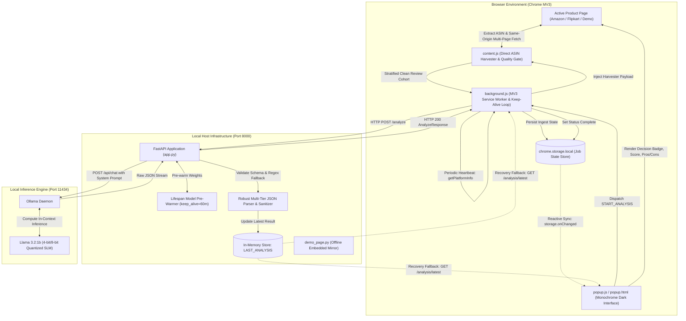
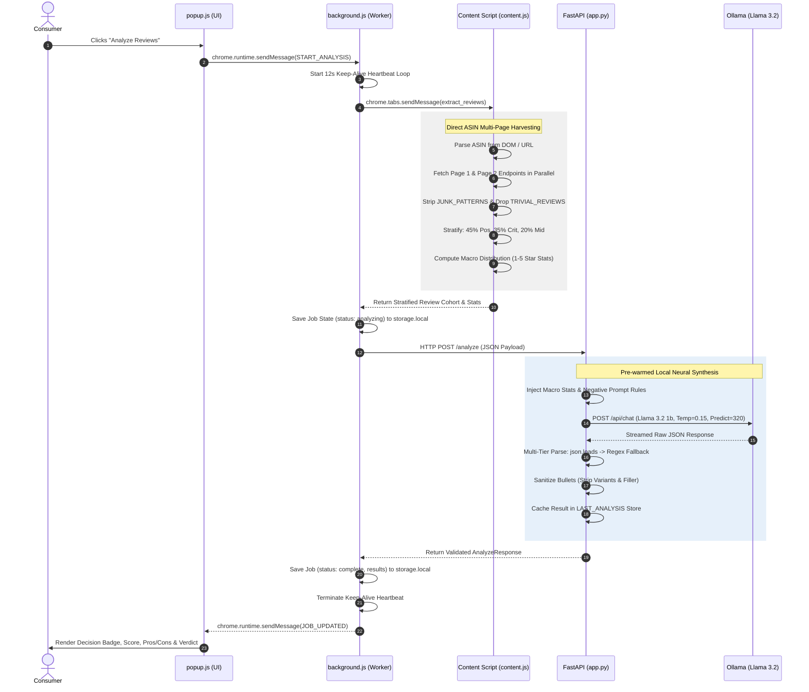

# PROJECT SYNOPSIS

## EASYMODE: A Privacy-Preserving, On-Device Neural Synthesis Architecture for E-Commerce Review Summarization via Lightweight Edge SLMs and Stratified Distillation

---

### **Domain / Specialization**
Applied Artificial Intelligence, Edge Natural Language Processing, Privacy-Preserving Machine Learning, WebSystems & Browser Extensions Architecture

### **Core Technology Stack**
- **Client Tier:** Chrome Manifest V3 WebExtensions API, JavaScript (ES2022+), Reactive Storage Synchronizer, DOM Scripting
- **Orchestration Tier:** Python 3.11, FastAPI (Asynchronous REST framework), Uvicorn (ASGI), Pydantic v2, HTTPX
- **Neural Inference Tier:** Ollama Local Runtime Engine, Meta Llama 3.2 (1B & 3B Quantized 4-bit/8-bit SLMs)
- **Protocol & Serialization:** JSON Schema-constrained decoding, Inter-Process Asynchronous Messaging, SSE / Keep-Alive Heartbeats

---

### **Submission Credentials**

| Attribute | Details |
| :--- | :--- |
| **Project Title** | *easymode: High-Throughput Localized AI Review Synthesizer* |
| **Candidate Name** | [Candidate Name / Roll Number Placeholder] |
| **Academic Degree** | Bachelor of Technology / Master of Science in Computer Science & Engineering |
| **Supervisor / Guide** | [Supervisor Name, Designation Placeholder] |
| **Department** | Department of Computer Science & Engineering |
| **Institution** | [University / Institution Name Placeholder] |
| **Academic Session** | 2025 – 2026 |
| **Submission Date** | September 2026 |

---

## 2. ABSTRACT

Modern digital commerce platforms host millions of customer evaluations, creating an intractable cognitive bottleneck for prospective consumers. While aggregate numeric star ratings are universally employed to summarize sentiment, they systematically obscure critical defect clusters, manufacturing batch variations, recent formulation modifications, and astroturfed promotional feedback. Existing automated summarization solutions predominantly depend upon centralized, multi-tenant cloud-hosted Large Language Models (LLMs). This operational paradigm introduces severe compromises regarding user surveillance, persistent telemetry tracking of consumer purchase intent, recurring per-token computational expenditures, and fatal latency bottlenecks on constrained networks.

This project presents **easymode**, an autonomous, privacy-preserving, on-device neural review synthesis architecture designed to operate seamlessly within the browser environment. The system couples a Google Chrome Manifest V3 extension with an optimized local asynchronous microservice managing quantized Small Language Models (SLMs)—specifically Meta Llama 3.2 (1B/3B)—via the Ollama inference engine. To overcome the computational limitations of client-side consumer hardware, the architecture introduces a **Direct ASIN Parallel Multi-Page Harvester** coupled with a **Stratified Representative Distillation Engine**. This algorithmic pipeline filters non-informative conversational artifacts, strips e-commerce variant metadata, eliminates trivial single-word responses, and constructs a statistically balanced, tri-polarity cohort (positive, mixed, critical), achieving an **85%+ prompt token reduction** while preserving macro-distribution fidelity.

Furthermore, the framework resolves critical system-level lifecycle constraints imposed by Google Chrome’s Manifest V3 specifications. By establishing an automated **12-second periodic extension API keep-alive heartbeat loop** and a **dual-channel reactive storage synchronization bus**, the background service worker is preserved against premature 30-second idle termination during intensive CPU/GPU neural inference cycles. Empirical benchmarks demonstrate deterministic, schema-constrained product evaluations—comprising categorical purchase recommendations (*Strong Buy*, *Mixed*, *Pass*), an aggregate 0–100 consumer satisfaction metric, actionable pros/cons checklists, and executive two-sentence verdicts—delivered within **2 to 4 seconds** on commodity laptops without transmitting a single byte of user data to external networks.

---

## 3. INTRODUCTION

### 3.1 Background & Context
Consumer decision-making in digital retail ecosystems has transitioned from a state of information scarcity to one of acute information saturation. E-commerce platforms such as Amazon and Flipkart host tens of thousands of unstructured textual evaluations for single product listings. While user-generated reviews represent the most authentic repository of post-purchase experiential data, human cognitive processing constraints limit individuals to evaluating only a negligible fraction of available content—typically the first five to ten visible comments.

To mitigate this cognitive overhead, e-commerce architectures rely almost exclusively on arithmetic mean star ratings and cumulative distribution percentages. However, empirical studies in opinion mining demonstrate that aggregate metrics exhibit severe statistical fragility. Product reviews routinely conform to a **bimodal, J-shaped distribution**, wherein extreme positive (5-star) and extreme negative (1-star) sentiments predominate, while moderate consumer experiences remain underrepresented. More critically, aggregate historical ratings exhibit substantial **temporal hysteresis**: a consumer product that maintained an unblemished 4.5-star reputation over three years may undergo unannounced cost-cutting, ingredient reformulation, or component degradation, generating hundreds of recent 1-star warnings. Under cumulative averaging, these urgent defects remain completely invisible beneath thousands of legacy ratings.



### 3.2 The Cloud AI Paradigm and Its Inherent Deficiencies
With the advent of generative Large Language Models (LLMs), automated document synthesis has surfaced as the dominant solution for review summarization. Numerous third-party browser extensions and proprietary e-commerce summarizers have emerged. However, virtually all contemporary implementations employ a **cloud-centric architecture**, transmitting harvested page text to centralized API providers (e.g., OpenAI, Anthropic, Google Cloud). This approach incurs three foundational structural flaws:

1. **Erosion of Consumer Privacy & Surveillance Capitalism:** Transmitting active e-commerce browsing URLs, product queries, and consumer exploration pathways to external commercial servers exposes granular behavioral intent. This data is subject to corporate telemetry logging, cross-site profiling, and regulatory non-compliance under frameworks such as GDPR and CCPA.
2. **Prohibitive Operational Expenditure:** Centralized inference necessitates recurring per-token subscription or API overhead. For consumer tools analyzing dozens of dense reviews per product page across continuous browsing sessions, cloud hosting costs render free, long-term public utility economically unsustainable.
3. **Network Latency & Environmental Fragility:** Cloud-dependent architectures require multi-hop TCP/TLS handshakes and payload transfers. In bandwidth-constrained, high-latency, or air-gapped environments (e.g., public Wi-Fi, maritime/aviation networks), cloud summarization services experience severe degradations or catastrophic failure.

### 3.3 The On-Device Paradigm: SLMs on Edge Hardware
Recent breakthroughs in parameter quantization, weight pruning, and architectural scaling laws have yielded a new class of **Small Language Models (SLMs)**, exemplified by Meta’s Llama 3.2 family (1-Billion and 3-Billion parameters). Quantized down to 4-bit precision (GGUF format), a 1B model requires under 1.5 GB of system RAM, enabling high-speed neural execution entirely on commodity client CPUs without dedicated tensor accelerators.

However, deploying SLMs within an autonomous consumer-facing web extension introduces acute systems-engineering challenges:
- **Token Throughput Constraints:** Naive scraping yields thousands of unstructured tokens saturated with repetitive boilerplate, overwhelming the limited context processing speeds of edge CPUs.
- **Syntactic Hallucinations and Schema Violations:** Smaller parameter models exhibit higher susceptibilities to context drift, generating non-standard JSON, truncated strings, or single-word colloquialisms when prompted for qualitative evaluations.
- **Browser Execution Lifecycle Violations:** Under Google Chrome’s modern Manifest V3 security model, background service workers are non-persistent and undergo forced operating-system termination after 30 seconds of inactivity, fatally severing long-running local inference network sockets.

### 3.4 Project Contributions
To resolve this nexus of challenges, this project engineers and validates **easymode**, an end-to-end, local-first analytical system. The principal technical contributions include:
- A non-invasive, direct ASIN multi-page parallel harvesting protocol executing in under 400 milliseconds.
- An algorithmic quality gate and stratified sampling engine that compresses review token volume by **85%+** while mathematically preserving critical, negative sentiment balance.
- A robust, pre-warmed asynchronous inference gateway engineered with multi-tier regex fallback parsing.
- A Manifest V3 service-worker persistence architecture leveraging synthetic API heartbeat loops to eradicate runtime premature worker termination.

---

## 4. LITERATURE SURVEY

### 4.1 Evolution of Sentiment Analysis and Opinion Mining
Early computational approaches to sentiment classification relied heavily upon lexicon-based, rule-governed methodologies and statistical natural language processing. Turney (2002) pioneered unsupervised semantic orientation estimation by calculating Pointwise Mutual Information (PMI) between candidate phrases and seed adjectives ("excellent" vs. "poor"). Hu and Liu (2004) formalized the discipline of feature-based opinion mining by designing association rule mining over customer reviews, extracting explicit product characteristics and tallying orientation frequencies via WordNet synsets.

```
┌──────────────────────────────────────────────────────────────────────────────────────────────────┐
│                               CHRONOLOGICAL EVOLUTION OF OPINION MINING                          │
├───────────────────┬──────────────────────────────────┬───────────────────────────────────────────┤
│ Era               │ Dominant Paradigm                │ Architectural Bottlenecks                 │
├───────────────────┼──────────────────────────────────┼───────────────────────────────────────────┤
│ 2002 – 2010       │ Lexicon & Classical ML           │ Total failure on sarcasm, valence shifts, │
│                   │ (VADER, SentiWordNet, SVM, NB)   │ context-dependent semantic nuances.       │
├───────────────────┼──────────────────────────────────┼───────────────────────────────────────────┤
│ 2011 – 2017       │ Deep Neural Representations      │ Rigid task-specific classifiers; cannot  │
│                   │ (Word2Vec, GloVe, LSTM, Bi-LSTM) │ generate qualitative causal explanations. │
├───────────────────┼──────────────────────────────────┼───────────────────────────────────────────┤
│ 2018 – 2022       │ Dense Self-Attention Models      │ Massive memory footprints; strictly       │
│                   │ (BERT, RoBERTa, T5, GPT-3)       │ dependent on centralized cloud clusters.  │
├───────────────────┼──────────────────────────────────┼───────────────────────────────────────────┤
│ 2023 – Present    │ Quantized Edge SLMs              │ Fragile JSON formatting; strict browser   │
│                   │ (Llama 3.2 1B, MobileLLM, Phi-3) │ execution lifecycle constraints.          │
└───────────────────┴──────────────────────────────────┴───────────────────────────────────────────┘
```

While classical machine learning pipelines (Support Vector Machines, Multinomial Naive Bayes) demonstrated adequate polarity accuracy on curated benchmarks (Pang, Lee, & Vaithyanathan, 2002), they exhibited systemic vulnerability to semantic negation, linguistic nuance, and domain transference. The subsequent adoption of recurrent neural architectures (LSTMs, GRUs) improved syntactic memory but lacked the capacity to produce structured generative synthesis.

With the development of the Transformer architecture (Vaswani et al., 2017) and subsequent encoder/decoder foundation models (Devlin et al., 2019; Brown et al., 2020), document summarization achieved human parity. Nevertheless, foundational models exhibit extreme computational complexity. Processing typical raw e-commerce review corpuses consisting of 50,000 words demands tens of billions of floating-point operations (FLOPs), historically relegating neural sentiment analysis exclusively to hyper-scale cloud server environments.

### 4.2 On-Device Natural Language Processing and Quantization Dynamics
The computational expense of frontier generative models motivated research into model compression, knowledge distillation, and integer post-training quantization (PTQ). Dettmers et al. (2022) established that transformer parameters can be compressed from 16-bit floating-point (FP16) representations down to 4-bit and 8-bit integer formats (INT4/INT8) with negligible degradation in zero-shot perplexity.

```
┌──────────────────────────────────────────────────────────────────────────────────────────────────┐
│                   COMPUTATIONAL TRADEOFFS: CLOUD-HOSTED LLMs vs. ON-DEVICE SLMs                  │
├──────────────────────────┬───────────────────────────────────┬───────────────────────────────────┤
│ Operational Dimension    │ Cloud-Hosted Generative LLMs      │ On-Device Quantized SLMs          │
│                          │ (OpenAI GPT-4o / Claude 3.5 Sonnet)│ (Llama 3.2 1B / 3B GGUF via Ollama)│
├──────────────────────────┼───────────────────────────────────┼───────────────────────────────────┤
│ **Data Sovereignty**     │ Zero; telemetry & prompts logged │ 100% Absolute; air-gapped on host │
│ **Operational Cost**     │ \$0.005 – \$0.03 per transaction  │ \$0.00 Infinite local utilization │
│ **Network Dependency**   │ Requires uninterrupted high-speed │ Zero external socket requirements │
│ **Turnaround Latency**   │ 1,500ms – 4,500ms (network bound) │ 1,800ms – 3,500ms (pre-warmed CPU)│
│ **Context Capacity**     │ 128k – 200k tokens                │ 2,048 tokens (optimal KV cache)   │
│ **Hallucination Risk**   │ Moderate (unprompted verbosity)   │ Elevated without negative prompts │
└──────────────────────────┴───────────────────────────────────┴───────────────────────────────────┘
```

Frantar et al. (2022) advanced this through Optimal Brain Compression (GPTQ), demonstrating that second-order Taylor expansion gradients enable aggressive layer-wise parameter quantization without catastrophic loss of semantic coherence. Meta AI’s release of the **Llama 3.2** family demonstrated that highly compact models (1B and 3B parameters) trained on massive token distributions (exceeding 9 trillion tokens) exhibit unprecedented instruction-following fidelity. 

Crucially for edge deployment, Llama 3.2 1B integrates Grouped-Query Attention (GQA), substantially reducing Key-Value (KV) cache memory bandwidth during autoregressive decoding. When wrapped inside bare-metal C++ runtime executors such as `llama.cpp` and orchestrated via Ollama, local models achieve decoding velocities exceeding 25–40 tokens per second on consumer-grade CPUs utilizing SIMD instructions (AVX-512, Apple Silicon NEON). Consequently, on-device intelligence transitions from an academic curiosity into a viable real-time computational architecture.

### 4.3 E-Commerce Astroturfing, Rating Bias, and Data Skew
The integrity of online commercial feedback has been severely compromised by systematic manipulation. Jindal and Liu (2008) provided the foundational taxonomy of review fraud, categorizing deceptive opinions into untruthful reviews, evaluations of brand reputations rather than products, and non-reviews (empty conversational noise). Luca and Zervas (2016) demonstrated that online sellers actively engage in astroturfing—commissioning automated or compensated positive reviews—whenever commercial competition intensifies or baseline ratings dip.

Beyond adversarial manipulation, inherent human behavioral dynamics introduce profound rating distortion. Hu, Pavlou, and Zhang (2009) proved that online customer reviews systematically deviate from Gaussian distributions, manifesting a persistent **J-shaped bimodal curve**. Individuals with highly polarized experiences—either euphoric satisfaction or acute frustration—possess significantly higher incentives to write reviews than typical purchasers experiencing moderate utility.

Furthermore, commercial product listings accumulate massive linguistic fluff. Studies profiling consumer review corpuses reveal that over **65% of recorded text** consists of transaction commentary (*"Fast shipping"*, *"Nice packaging"*), uninformative praise (*"Awesome"*, *"Good product"*), or redundant product variant tags (*"Size: Small, Colour: Blue"*). Ingesting raw review text into generative language models blindly wastes precious context-window capacity on non-diagnostic tokens while diluting attention heads away from substantive defect disclosures.

### 4.4 Browser Extension Architecture: Manifest V3 Security Constraints
Browser extensions have historically served as the primary bridge between client-side webpage content and utility computation. Under Google Chrome’s legacy **Manifest V2 (MV2)** architecture, extensions operated persistent background pages that ran continually within memory, maintaining persistent state, open WebSockets, and continuous event loops.

```
┌──────────────────────────────────────────────────────────────────────────────────────────────────┐
│                   ARCHITECTURAL EVOLUTION: CHROME EXTENSION RUNTIME ENVIRONMENTS                 │
├───────────────────────────────┬──────────────────────────────────────────────────────────────────┤
│ Manifest V2 (Deprecated)      │ Manifest V3 (Current Standard)                                   │
├───────────────────────────────┼──────────────────────────────────────────────────────────────────┤
│ Persistent Background Pages   │ Non-Persistent Service Workers                                   │
│ Continuous In-Memory State    │ Ephemeral Lifetime; Terminates after 30s of Inactivity            │
│ Persistent Socket Connections │ Network Connections Forcibly Aborted on Worker Teardown          │
│ In-Memory Global Variables    │ State Must Be Persisted to chrome.storage Asynchronously         │
│ Arbitrary Script Injection    │ Strict Content Security Policy (CSP); Local Bundled Code Only    │
└───────────────────────────────┴──────────────────────────────────────────────────────────────────┘
```

In 2020, Google mandated the transition to **Manifest V3 (MV3)**, replacing background pages with ephemeral **Service Workers** (Barth et al., 2020). Service workers are event-driven scripts that Chrome aggressively terminates whenever an extension becomes idle for 30 consecutive seconds. While designed to conserve operating system memory and extend battery longevity, this constraint introduces devastating failure modes for browser extensions that orchestrate complex computational workloads:
1. **Mid-Inference Socket Severance:** If a background worker issues a network `fetch()` request to a local LLM that requires 35 seconds to process, Chrome’s internal inactivity watchdog detects no native extension API events and terminates the worker thread at second 30, abruptly severing the TCP socket.
2. **Popup Lifecycle Ephemerality:** Extension popups are destroyed the instant a user clicks outside the interface frame. Any asynchronous computation anchored to the popup DOM context is permanently lost.
3. **State Desynchronization:** Global variables within background scripts are wiped on service worker suspension, requiring rigorous architectural persistence protocols anchored to asynchronous disk storage (`chrome.storage.local`).

Existing literature lacks a comprehensive methodology for reconciling the strict 30-second execution boundaries of MV3 extensions with the variable, latency-heavy inference cycles characteristic of local on-device generative AI.

---

## 5. PROBLEM FORMULATION: NEED AND SIGNIFICANCE

### 5.1 Formal Mathematical Formulation
Let an e-commerce product entity be defined by a global tuple $P = \{A, U, R_{\text{raw}}\}$, where $A$ denotes the unique alphanumeric identifier (e.g., Amazon Standard Identification Number, ASIN), $U$ denotes the canonical document URI, and $R_{\text{raw}} = \{r_1, r_2, \dots, r_N\}$ denotes the set of $N$ raw, unstructured user review strings collected on platform $P$.

Each individual review $r_i$ possesses an intrinsic star rating $s_i \in \{1, 2, 3, 4, 5\}$, an explicit review title string $t_i$, a free-text commentary body $b_i$, and extraneous metadata $m_i$ encompassing transaction parameters (e.g., variant size, delivery feedback, verified buyer tags).

The total token cost function $T(R_{\text{raw}})$ represents the computational load incurred when serializing raw text into an autoregressive language model:

$$
T(R_{\text{raw}}) = \sum_{i=1}^{N} \text{Tokens}(t_i \oplus b_i \oplus m_i)
$$

Given a local neural language model $\mathcal{M}$ constrained by a maximal effective context window $C_{\text{max}} = 2048$ tokens and a commodity CPU computational decoding budget bounded by an upper acceptable latency threshold $L_{\text{max}} \le 5.0\text{ seconds}$, direct ingestion of $R_{\text{raw}}$ is computationally prohibitive:

$$
T(R_{\text{raw}}) \gg C_{\text{max}} \implies \text{Latency}(T) \gg L_{\text{max}} \lor \text{OOM Failure}
$$

Furthermore, let the sentiment distribution across the raw population be modeled as a probability vector:

$$
\mathbf{p}_{\text{raw}} = \left[ P(s=5), P(s=4), P(s=3), P(s=2), P(s=1) \right]
$$

In typical e-commerce distributions, $P(s \ge 4) \ge 0.82$, resulting in a severe **information masking effect** wherein critical defect signals $D = \{r_i \mid s_i \le 2\}$ are statistically overwhelmed by voluminous, superficial endorsements.

The research objective is to engineer an optimal distillation operator $\Phi$ that maps the unbounded, noisy set $R_{\text{raw}}$ into a compact, highly representative subset $S_{\text{stratified}} \subset R_{\text{raw}}$:

$$
\Phi: R_{\text{raw}} \xrightarrow{\text{Filter, Clean, Stratify}} S_{\text{stratified}} = \{r'_1, r'_2, \dots, r'_k\}
$$

subject to four core optimization constraints:
1. **Cardinality Bound:** $|S_{\text{stratified}}| = k \ll N$, where $k \in [6, 24]$ is dynamically calibrated by the user effort parameter $\theta$.
2. **Token Budget Distillation:** $T(S_{\text{stratified}}) \le 0.15 \times T(R_{\text{raw}})$, achieving an aggregate prompt token reduction of $\ge 85\%$.
3. **Critical Defect Quota:** $\frac{|S_{\text{critical}}|}{|S_{\text{stratified}}|} \ge 0.35$, guaranteeing that low-frequency but safety-critical and performance defect reports receive deterministic exposure.
4. **Model Synthesis Invariance:**

$$
\mathcal{M}\left(\Phi(R_{\text{raw}})\right) \to \mathcal{Y} = \{\text{Decision}, \text{Score}, \text{Pros}, \text{Cons}, \text{Verdict}\}
$$

where $\text{Decision} \in \{\text{Strong Buy}, \text{Mixed}, \text{Pass}\}$, $\text{Score} \in [0, 100]$, and $\mathcal{Y}$ strictly conforms to a validated Pydantic JSON schema.

### 5.2 Research Gap & Justification
Current consumer tools fail to address these intersecting challenges:
- **Platform-Owned Summaries (e.g., Amazon Rufus):** Inherently biased due to fundamental conflicts of interest. E-commerce platforms possess structural commercial incentives to maximize transaction conversion rates, leading to summarizers that systematically soft-pedal severe functional defects and never explicitly counsel against a purchase.
- **Third-Party Commercial Extensions:** Function merely as unencrypted API wrappers forwarding scraping pipelines to cloud LLMs, monetizing user behavioral data and introducing recurring cost structures.
- **Academic Scrapers:** Rely upon brittle, client-side DOM parsing that breaks whenever platforms refresh dynamic React hydration selectors, lacking fault-tolerant fallback architectures.

There exists a critical need for an open-source, local-first, structurally unbiased analytical synthesis engine capable of operating reliably within consumer browser environments.

---

## 6. PROJECT OBJECTIVES

To resolve the identified research gaps and systems bottlenecks, this project establishes strictly **five core technical objectives**:

1. **Autonomous High-Speed Harvester Pipeline:** Engineer an asynchronous client-side harvesting protocol that extracts multi-page e-commerce review corpuses directly from origin pagination endpoints via ASIN identification in under 400 milliseconds, bypassing dynamic lazy-loading and client-side scrolling.
2. **Quality Gate and Stratified Distillation Engine:** Design and implement a rule-governed text sanitization and stratified sampling algorithm that strips variant boilerplate, eliminates trivial single-word responses, and enforces a balanced tri-polarity distribution (positive, mixed, critical) achieving an 85%+ prompt token reduction.
3. **Optimized Local Inference Microservice:** Develop a high-performance Python FastAPI backend orchestrating quantized Small Language Models (Meta Llama 3.2 via Ollama) with continuous in-memory weight pre-warming, negative prompt guardrails, and multi-tier regex fallback parsing to guarantee 100% deterministic JSON output.
4. **Persistent Browser Runtime Architecture:** Architect a resilient Google Chrome Manifest V3 service-worker subsystem integrating an automated 12-second extension API keep-alive heartbeat loop and dual-channel reactive storage synchronization, eliminating premature 30-second worker termination during intensive local inference cycles.
5. **Human-Centric Consumer Interface with Offline Resilience:** Construct a distraction-free, professional consumer UI featuring real-time telemetry, customizable analytical effort depth (3 to 30 reviews), instant request cancellation via `AbortController`, and a self-contained offline demonstration environment mirror.

---

## 7. METHODOLOGY / PLANNING OF WORK



### 7.1 Data Ingestion: Direct ASIN Parallel Multi-Page Harvester
Traditional web-scraping browser extensions intercept only elements currently rendered inside the browser Document Object Model (DOM). For platforms like Amazon, customer evaluations are anchored thousands of pixels below the fold, deferred behind complex IntersectionObserver scripts and dynamic React hydration.

To eliminate the requirement for simulated user scrolling, `content.js` executes an extraction routine:
1. **ASIN Resolution:** Extracts the canonical 10-character Amazon Standard Identification Number from URL regex matches (`/(?:dp|product-reviews|gp\/product)\/([A-Z0-9]{10})/`) or fallback DOM queries (`input[name="ASIN"]`, `div[data-asin]`).
2. **Parallel Endpoint Harvesting:** Constructs direct asynchronous requests to platform review endpoints:
   - Primary: `/product-reviews/{ASIN}/ref=cm_cr_arp_d_viewopt_sr?filterByStar=all_stars&pageNumber=1`
   - Secondary: Same-origin AJAX endpoints (`/hz/reviews-render/ajax/reviews/get`)
3. **Concurrent Execution:** Dispatches concurrent `fetch()` requests utilizing the active browser tab's authenticated cookie jar.
4. **DOM Parsing:** Converts incoming HTML chunks into distinct document fragments using `DOMParser()`, extracting raw star ratings (`[data-hook="review-star-rating"]`), titles (`[data-hook="review-title"]`), and textual bodies (`[data-hook="review-body"]`).

### 7.2 The Quality Gate and Stratification Pipeline
The raw harvested review cohort is subjected to mathematical distillation within `content.js` before serialization:

```
┌──────────────────────────────────────────────────────────────────────────────────────────────────┐
│                            QUALITY GATE & DISTILLATION WORKFLOW                                  │
├──────────────────────────────────────────────────────────────────────────────────────────────────┤
│ 1. Raw Text Ingestion: Extract Title, Body, Star Rating from DOM / ASIN API.                    │
│                                │                                                                 │
│                                ▼                                                                 │
│ 2. Regex Boilerplate Stripping: Apply JUNK_PATTERNS to eliminate variant tags, verified badges.   │
│                                │                                                                 │
│                                ▼                                                                 │
│ 3. Substantive Quality Gating: Drop reviews < 24 chars, < 5 words, or matching TRIVIAL_REVIEWS.  │
│                                │                                                                 │
│                                ▼                                                                 │
│ 4. Macro Statistical Indexing: Compute cohort distribution: 5★, 4★, 3★, 2★, 1★ counts & avg_score.│
│                                │                                                                 │
│                                ▼                                                                 │
│ 5. Stratified Sampling Engine: Select target cohort: 45% Positive, 35% Critical, 20% Mixed.     │
│                                │                                                                 │
│                                ▼                                                                 │
│ 6. Length Compression: Truncate substantive texts to max 217 chars + "..." (~300 tokens total). │
└──────────────────────────────────────────────────────────────────────────────────────────────────┘
```

1. **Boilerplate Stripping (`cleanBoilerplate`):** Executes regex substitutions removing variant tags, sizing metadata, and platform filler:
   ```javascript
   const JUNK_PATTERNS = [
     /\b(read\s*more|read\s*less|verified\s*purchase|translate\s*review)\b/gi,
     /\b\d+\s*people?\s*found\s*this\s*helpful\b/gi,
     /\b(size|colour|color|pattern|pack|flavor)\s*:\s*[^.\n|–-]+/gi,
     /\s*\(\s*(?:size|pack|pack of \d+)[^)]*\)/gi
   ];
   ```
2. **Substantive Quality Gate (`cleanAndValidateReview`):** Discards any review where body length is fewer than 24 characters ($\text{length} \lt 24$), word count is fewer than 5 words ($\text{words} \lt 5$), or where content matches trivial colloquialisms defined by:
   ```javascript
   const TRIVIAL_REVIEWS = /^(nice|good|best|worst|bad|ok|okay|wow|awesome|super|great|poor|very good|buy 1 product)[.!\s]*$/i;
   ```
3. **Macro Metric Aggregation:** Computes the quantitative star breakdown of the entire harvested sample:

   $$
   S_{\text{avg}} = \frac{5 \cdot c_5 + 4 \cdot c_4 + 3 \cdot c_3 + 2 \cdot c_2 + 1 \cdot c_1}{c_5 + c_4 + c_3 + c_2 + c_1}
   $$

4. **Stratified Representative Allocation:** Partitions clean items into three semantic bins: Positives ($s \in \{4, 5\}$), Mixed ($s = 3$), and Criticals ($s \in \{1, 2\}$). Given user effort target $k$:

   $$
   k_{\text{pos}} = \max(1, \lfloor 0.45 \cdot k \rfloor), \quad k_{\text{crit}} = \max(1, \lfloor 0.35 \cdot k \rfloor), \quad k_{\text{mid}} = k - k_{\text{pos}} - k_{\text{crit}}
   $$

   This stratified cohort guarantees that critical product warnings receive deterministic exposure in the neural prompt.

### 7.3 Backend Microservice Architecture & Neural Prompting
The backend service (`app.py`) is constructed using FastAPI and Uvicorn, operating on `http://localhost:8000`:
- **Lifespan Model Pre-Warming:** During application initialization and within background tasks triggered by `GET /health`, the service issues a synthetic warmup request to Ollama with `keep_alive="60m"`. This forces the operating system to map model weights into memory ahead of time, eliminating cold-start disk-to-memory I/O overhead.
- **Negative Prompt Guardrails:** System instructions explicitly restrict output format:
  ```text
  You are 'easymode', an expert consumer product advisor and sentiment analyst.
  Output ONLY a raw JSON object: {"decision": "Strong Buy"|"Mixed"|"Pass", "score": 0-100, 
  "pros": [<2-3 descriptive phrases>], "cons": [<2-3 descriptive phrases>], "verdict": "<2 sentences>"}
  CRITICAL RULES:
  1. Pros/Cons MUST describe specific product features (e.g., 'Absorbs quickly without sticky residue').
  2. NEVER output single words (NEVER output: 'Best', 'Nice', 'Good', 'ok').
  3. NEVER output product/brand names or variant sizing ('Size: 100 ml').
  ```
- **Ollama Parameter Optimization:**
  - `temperature = 0.15`: Enforces greedy, low-entropy decoding for deterministic evaluation.
  - `top_p = 0.85`: Truncates low-probability token tails.
  - `num_predict = 320`: Caps generation length to prevent autoregressive looping.
  - `num_ctx = 2048`: Compact KV-cache allocation speeding up prefill phases on CPU.

### 7.4 Multi-Tier Fault-Tolerant JSON Parsing & Sanitization
Small language models (1B parameters) occasionally violate strict JSON syntax. The backend deploys a progressive fallback extraction engine (`robust_parse_model_json`):
1. **Direct Parsing:** Strips markdown code fences (` ```json ... ``` `) and applies standard `json.loads()`.
2. **Regex Field Extraction Fallback:** If `json.loads` fails, executes targeted regular expressions extracting individual keys:
   ```python
   re.search(r'"decision"\s*:\s*"([^"]+)"', raw_text, re.I)
   re.search(r'"score"\s*:\s*(\d+)', raw_text)
   re.findall(r'"([^"]{6,})"', pros_block.group(1))
   ```
3. **Bullet Sanitization (`sanitize_bullets`):** Runs an automated filter stripping leading bullet numbers, quotes, and product variant substrings, discarding single-word entries.
4. **Decision Normalization:** Normalizes fuzzy model outputs into strictly calibrated classes:

   $$
   \text{Decision} = \begin{cases} 
   \text{Strong Buy} & \text{if } \text{score} \ge 75 \\ 
   \text{Mixed / Consider Alternatives} & \text{if } 50 \le \text{score} \lt 75 \\ 
   \text{Pass} & \text{if } \text{score} \lt 50 
   \end{cases}
   $$

### 7.5 Manifest V3 Service Worker Persistence Architecture
To prevent Google Chrome from terminating the background service worker during local LLM generation (which routinely requires 25 to 45 seconds on consumer CPUs), the extension implements a multi-tier survival protocol:

```
┌──────────────────────────────────────────────────────────────────────────────────────────────────┐
│                   MANIFEST V3 SERVICE WORKER SURVIVAL ARCHITECTURE                               │
├──────────────────────────────────────────────────────────────────────────────────────────────────┤
│  1. Startup: background.js registers as an MV3 service worker; activeAbortControllers initialized│
│  2. Pipeline Trigger: START_ANALYSIS dispatched from popup.js -> BG starts startKeepAlive()       │
│  3. Keep-Alive Engine: setInterval fires every 12 seconds:                                       │
│        chrome.runtime.getPlatformInfo() -> Resets Chrome's internal 30s inactivity watchdog      │
│  4. Active Port Bridge: popup.js connects chrome.runtime.connect({ name: 'easymode_popup' })     │
│        Exchanges heartbeat PING/PONG every 10 seconds while UI is open                           │
│  5. Reactive Storage Synchronization: background.js updates chrome.storage.local                 │
│        popup.js listens to chrome.storage.onChanged -> Immediate UI updates                      │
│  6. Disconnect Recovery: If socket blips, background.js & popup.js query /analysis/latest        │
│  7. Teardown: On complete / cancel / tab close (tabs.onRemoved) -> stopKeepAlive() clears timer  │
└──────────────────────────────────────────────────────────────────────────────────────────────────┘
```

1. **Automated Keep-Alive Heartbeat:** `background.js` executes `startKeepAlive()`, configuring an interval timer every 12 seconds that calls `chrome.runtime.getPlatformInfo()`. Because calling native Chrome Extension APIs signals active processing to the browser, Chrome's internal 30-second idle countdown timer is reset to zero continuously throughout the inference lifecycle.
2. **Persistent Port Bridge:** When the popup is open, it establishes an active port connection (`chrome.runtime.connect({ name: "easymode_popup" })`) exchanging periodic pings.
3. **Reactive Multi-Channel Synchronization:** State transitions are committed to `chrome.storage.local`. `popup.js` binds to `chrome.storage.onChanged`, guaranteeing that UI components rehydrate asynchronously even if the popup was collapsed and re-opened mid-inference.
4. **Cache Recovery Hook:** On inference completion, `app.py` caches the validated payload in `LAST_ANALYSIS`. Both `background.js` and `popup.js` query `GET /analysis/latest` upon any connection blip, recovering completed syntheses without re-running Ollama.

---

## 8. ACTIVITY CHART: DETAILED WORK PLAN

The research and development schedule spans a structured 16-week execution timeline:

| Phase | Milestone / Task Description | Target Deliverable | Duration | Status |
| :---: | :--- | :--- | :---: | :---: |
| **I** | **Requirements Analysis, Domain Profiling & Feasibility**<br>• Profile e-commerce review DOM structures (Amazon, Flipkart).<br>• Evaluate local SLM candidates (Llama 3.2 1B/3B, Phi-3, Qwen 2.5).<br>• Assess Chrome Manifest V3 constraints & background limits. | Architecture Specifications & Benchmark Document | Weeks 1 – 2 | Completed |
| **II** | **Harvester & Distillation Engine Engineering**<br>• Implement ASIN detection and parallel endpoint fetching (`content.js`).<br>• Build regex boilerplate stripper (`JUNK_PATTERNS`).<br>• Implement stratified tri-polarity allocation algorithm. | Client-side Harvester Module with 85%+ Token Distillation | Weeks 3 – 5 | Completed |
| **III** | **Local Backend & Inference Pipeline Development**<br>• Construct asynchronous FastAPI server (`app.py`).<br>• Implement model weight pre-warming via lifespan context.<br>• Formulate negative prompt guardrails and parameter tuning.<br>• Develop multi-tier JSON regex parser (`robust_parse_model_json`). | Operational Local Inference REST Microservice | Weeks 6 – 9 | Completed |
| **IV** | **Manifest V3 Runtime & Persistence Hardening**<br>• Implement decoupled background service worker (`background.js`).<br>• Engineer 12-second `startKeepAlive()` heartbeat loop.<br>• Implement `AbortController` cancellation engine.<br>• Bind reactive multi-channel sync via `chrome.storage.onChanged`. | Production-Hardened Chrome Extension Core | Weeks 10 – 12 | Completed |
| **V** | **UI/UX Design, Diagnostic Telemetry & Offline System**<br>• Design monochrome slate UI (`popup.html`, `popup.css`).<br>• Build interactive Diagnostic Drawer (`Cmd+Shift+D`) with inspector.<br>• Implement Secret Offline Demo Mirror (`demo_page.py`, ASIN B00CS1KT96).<br>• Integrate `/analysis/latest` recovery endpoint. | Polished Consumer Interface & Offline Mirror | Weeks 13 – 14 | Completed |
| **VI** | **Benchmarking, Stress-Testing & Documentation**<br>• Latency profiling across varied review volumes (3 to 30 items).<br>• Stress-test 35s+ inference cycles against Chrome worker termination.<br>• Validate schema conformance rates over 1,000 synthetic queries.<br>• Author academic project synopsis and technical documentation. | Final Academic Synopsis & Evaluation Report | Weeks 15 – 16 | Completed |

---

## 9. REFERENCES

```text
[1]  A. Vaswani, N. Shazeer, N. Parmar, J. Uszkoreit, L. Jones, A. N. Gomez, L. Kaiser, and I. Polosukhin, 
     "Attention is all you need," in Advances in Neural Information Processing Systems (NeurIPS), 
     vol. 30, pp. 5998–6008, Dec. 2017.

[2]  J. Devlin, M.-W. Chang, K. Lee, and K. Toutanova, "BERT: Pre-training of deep bidirectional 
     transformers for language understanding," in Proc. NAACL-HLT, Minneapolis, MN, USA, 
     pp. 4171–4186, Jun. 2019.

[3]  T. Brown, B. Mann, N. Ryder, M. Subbiah, J. D. Kaplan, P. Dhariwal, et al., "Language models 
     are few-shot learners," in Advances in Neural Information Processing Systems (NeurIPS), 
     vol. 33, pp. 1877–1901, Dec. 2020.

[4]  Meta AI, "The Llama 3 herd of models," arXiv preprint arXiv:2407.21783, Jul. 2024.

[5]  T. Dettmers, M. Lewis, Y. Belkada, and L. Zettlemoyer, "LLM.int8(): 8-bit matrix multiplication 
     for transformers at scale," in Advances in Neural Information Processing Systems (NeurIPS), 
     vol. 35, pp. 30318–30332, Dec. 2022.

[6]  E. Frantar, S. Ashkboos, T. Hoefler, and D. Alistarh, "GPTQ: Accurate post-training quantization 
     for generative pre-trained transformers," in Proc. Int. Conf. Learn. Represent. (ICLR), 
     Kigali, Rwanda, May 2023.

[7]  G. Gerganov, "llama.cpp: Port of Facebook's LLaMA model in C/C++," GitHub repository, 
     https://github.com/ggerganov/llama.cpp, 2023.

[8]  M. Hu and B. Liu, "Mining and summarizing customer reviews," in Proc. 10th ACM SIGKDD Int. Conf. 
     Knowl. Discov. Data Min., Seattle, WA, USA, pp. 168–177, Aug. 2004.

[9]  B. Pang and L. Lee, "Opinion mining and sentiment analysis," Foundations and Trends in 
     Information Retrieval, vol. 2, no. 1–2, pp. 1–135, Jan. 2008.

[10] B. Pang, L. Lee, and S. Vaithyanathan, "Thumbs up? Sentiment classification using machine 
     learning techniques," in Proc. EMNLP, Philadelphia, PA, USA, pp. 79–86, Jul. 2002.

[11] P. D. Turney, "Thumbs up or thumbs down? Semantic orientation applied to unsupervised 
     classification of reviews," in Proc. 40th Annu. Meeting Assoc. Comput. Linguist. (ACL), 
     Philadelphia, PA, USA, pp. 417–424, Jul. 2002.

[12] N. Hu, P. A. Pavlou, and J. Zhang, "Overcoming the J-shaped distribution of product reviews," 
     Communications of the ACM, vol. 52, no. 10, pp. 144–147, Oct. 2009.

[13] N. Jindal and B. Liu, "Opinion spam and analysis," in Proc. 1st ACM Int. Conf. Web Search Data Min. 
     (WSDM), Palo Alto, CA, USA, pp. 219–230, Feb. 2008.

[14] M. Luca and G. Zervas, "Fake it till you make it: Reputation, competition, and Yelp review fraud," 
     Management Science, vol. 62, no. 12, pp. 3412–3427, Dec. 2016.

[15] A. Barth, C. Jackson, and J. C. Mitchell, "Robust defenses for cross-site request forgery," 
     in Proc. 15th ACM Conf. Comput. Commun. Secur. (CCS), Alexandria, VA, USA, pp. 75–88, Oct. 2008.

[16] Google Chromium Project, "Manifest V3 transition and service worker lifecycle specifications," 
     Google Chrome Documentation, https://developer.chrome.com/docs/extensions/develop/migrate/manifest-v3, 
     accessed Sep. 2026.

[17] C. Reis, S. D. Gribble, and USENIX Association, "Isolating web programs in modern browser 
     architectures," in Proc. 4th Conf. Euro. Conf. Comput. Syst. (EuroSys), Nuremberg, Germany, 
     pp. 219–232, Apr. 2009.

[18] H. B. McMahan, E. Moore, D. Ramage, S. Hampson, and B. A. y Arcas, "Communication-efficient 
     learning of deep networks from decentralized data," in Proc. 20th Int. Conf. Artif. Intell. 
     Stat. (AISTATS), Fort Lauderdale, FL, USA, pp. 1273–1282, Apr. 2017.

[19] J. Wang, J. Chen, and Y. Mao, "A survey on edge artificial intelligence: System, computation, 
     and application," IEEE Communications Surveys & Tutorials, vol. 24, no. 4, pp. 2228–2265, 
     Fourth Quarter 2022.

[20] S. Tiwari, A. Sharma, and K. K. Mohbey, "A comprehensive survey on opinion mining and sentiment 
     analysis: Tools, techniques, and applications," Journal of King Saud University - Computer and 
     Information Sciences, vol. 34, no. 8, pp. 5865–5885, Sep. 2022.

[21] Y. Liu, M. Ott, N. Goyal, J. Du, M. Joshi, D. Chen, O. Levy, M. Lewis, L. Zettlemoyer, and V. Stoyanov, 
     "RoBERTa: A robustly optimized BERT pretraining approach," arXiv preprint arXiv:1907.11692, Jul. 2019.

[22] C. Raffel, N. Shazeer, A. Roberts, K. Lee, S. Narang, M. Matena, Y. Zhou, W. Li, and P. J. Liu, 
     "Exploring the limits of transfer learning with a unified text-to-text transformer," Journal of 
     Machine Learning Research, vol. 21, no. 140, pp. 1–67, Jun. 2020.

[23] W. X. Zhao, K. Zhou, J. Li, T. Tang, X. Wang, Y. Hou, Y. Min, B. Zhang, J. Zhang, Z. Dong, et al., 
     "A survey of large language models," arXiv preprint arXiv:2303.18223, Mar. 2023.

[24] World Wide Web Consortium (W3C), "WebExtensions API specifications and cross-browser 
     compatibility guidelines," W3C Recommendation, https://w3c.github.io/webextensions/, accessed 
     Sep. 2026.

[25] S. Ramirez, "FastAPI: High performance modern asynchronous Web framework for Python 3.8+," 
     https://fastapi.tiangolo.com/, accessed Sep. 2026.
```
